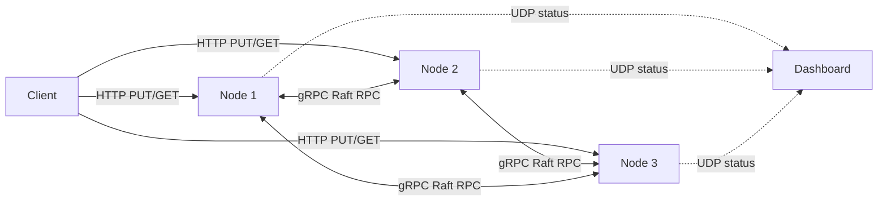
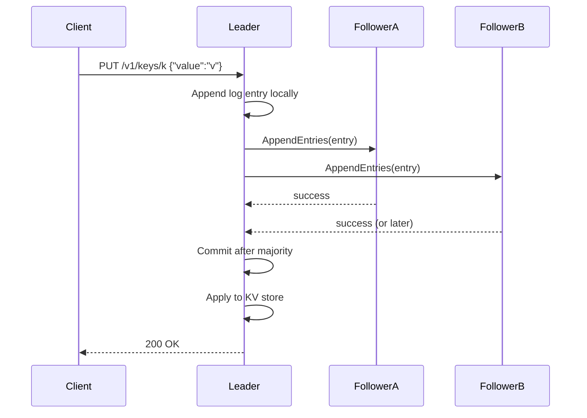
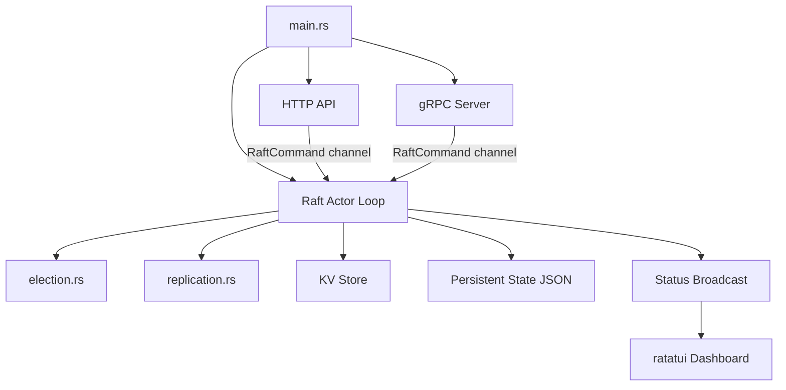

# Distributed KV Store (Raft)

This project is a **distributed key-value store** written in Rust.

Simple meaning:
- You can save values using a key (`PUT /v1/keys/<key>`).
- You can read values back (`GET /v1/keys/<key>`).
- Multiple nodes work together using the **Raft consensus algorithm**.

Raft helps all nodes agree on:
- who is leader,
- what order writes happen in,
- and what is safely committed.

## 1. Why This Project Exists

If a system has only one server, that server is a single point of failure.

So we run multiple nodes.
But now we need a way for all nodes to agree on writes.
That agreement protocol is called **consensus**.

This project uses **Raft consensus** for that.

---

## 2. Core Concepts (Very Simple)

- **Node**: one running server process.
- **Cluster**: group of nodes (for example, 3 nodes).
- **Leader**: the node that accepts client writes first.
- **Follower**: node that receives replicated entries from leader.
- **Candidate**: follower that is trying to become leader during election.
- **Term**: logical election round number.
- **Log entry**: one command like `Set { key, value }`.
- **Commit**: a log entry is safely replicated to a majority of nodes.
- **Apply**: execute committed entry on the local key-value store.

Important:
- **Only leader writes are valid** in this version.
- Followers may return redirect-like behavior for writes.

---

## 3. High-Level Architecture



Communication types:
- **HTTP**: client API (`GET`/`PUT`)
- **gRPC**: Raft internal RPC (`AppendEntries`, `RequestVote`)
- **UDP**: node status broadcast to dashboard

---

## 4. Project Layout

- `src/main.rs`: main node process (HTTP + gRPC + Raft actor)
- `src/raft/`: Raft logic
  - `election.rs`: elections and leadership transitions
  - `replication.rs`: log replication and commit/apply rules
  - `actor.rs`: async event loop that drives the node
  - `log.rs`: log helpers
  - `state.rs`: Raft state types
- `src/api/mod.rs`: HTTP API handlers
- `src/rpc/`: gRPC server/client glue
- `src/storage/mod.rs`: in-memory key-value state machine
- `src/sim/mod.rs`: deterministic simulation harness
- `src/dashboard.rs`: status payload + UDP broadcaster
- `src/bin/dashboard.rs`: terminal dashboard UI (ratatui)
- `tests/chaos.rs`: real-process chaos tests

---

## 5. Raft Flow in This Project

### 5.1 Leader Election

1. Follower timeout happens.
2. It becomes candidate and increments term.
3. It asks peers for votes (`RequestVote`).
4. If majority votes yes, it becomes leader.
5. Leader sends heartbeats (`AppendEntries` with empty entries).

### 5.2 Write Flow



---

## 6. Running the System

Because this repo now has multiple binaries (`kv`, `dashboard`), use `--bin`.

### 6.1 Start Dashboard

```bash
cargo run --bin dashboard
```

Press `q` to quit.

### 6.2 Start 3 Nodes (3 terminals)

Terminal A:
```bash
cargo run --bin kv -- 1
```

Terminal B:
```bash
cargo run --bin kv -- 2
```

Terminal C:
```bash
cargo run --bin kv -- 3
```

Ports used by node id `N`:
- HTTP: `3000 + N`
- gRPC: `4000 + N`

So node 1 HTTP is `3001`, node 2 is `3002`, etc.

### 6.3 Write and Read

Write:
```bash
curl -i -X PUT http://localhost:3001/v1/keys/name \
  -H "Content-Type: application/json" \
  -d '{"value":"alice"}'
```

Read:
```bash
curl -i http://localhost:3001/v1/keys/name
```

Tip:
- For write, ensure you get `HTTP 200`.
- If you get `307`, you likely sent to a follower.

---

## 7. Dashboard Meaning

Columns:
- `Node`: node id
- `Role`: Leader/Follower/Candidate
- `Term`: election term
- `Log`: local log length
- `Commit`: committed index
- `Applied`: last applied index
- `Status`: currently broadcast alive flag

How to read:
- Usually one node should be `Leader`.
- `Term` increases when elections happen.
- `Log`, `Commit`, `Applied` should converge across nodes over time.

---

## 8. Testing Strategy

This project uses **three testing layers**.

### Layer 1: Unit tests

Run:
```bash
cargo test
```

What it checks:
- local logic in `log.rs`, `election.rs`, `replication.rs`, etc.

### Layer 2: Simulation tests (in-memory cluster)

Located in `src/sim/mod.rs`.

What it checks:
- election in a deterministic network,
- write commit after majority,
- partition and new leader behavior.

Why useful:
- very fast,
- reproducible,
- good for Raft logic correctness.

### Layer 3: Chaos tests (real processes)

Located in `tests/chaos.rs`.

Run ignored chaos tests:
```bash
cargo test --test chaos -- --ignored --nocapture
```

What it checks:
- node restarts during writes,
- acknowledged writes are not lost.

---

## 9. System Design Diagram (Internal Components)



---

## 10. Next Good Improvements

1. Automatic leader forwarding for writes.
2. Dashboard stale timeout to mark dead nodes.
3. Stronger restart/recovery path from persisted state.
4. Expanded chaos matrix (longer runs, partitions + restarts combined).
5. Optional metrics endpoint (Prometheus-style counters).

---

## 11. Quick Demo Script

1. Start dashboard:
```bash
cargo run --bin dashboard
```
2. Start 3 nodes in separate terminals:
```bash
cargo run --bin kv -- 1
cargo run --bin kv -- 2
cargo run --bin kv -- 3
```
3. Send writes:
```bash
for i in $(seq 1 20); do
  curl -s -o /dev/null -w "%{http_code}\n" \
    -X PUT "http://localhost:3001/v1/keys/x$i" \
    -H "Content-Type: application/json" \
    -d "{\"value\":\"$i\"}"
done
```
4. Read one key:
```bash
curl http://localhost:3001/v1/keys/x1
```

---

## AI Disclosure

This project was built as a learning journey to deeply understand how distributed systems work in practice, especially leader election, replication, and fault handling in Raft.

To build complete understanding, I used AI tools for guidance and explanation, including Claude and ChatGPT. Codex was my primary coding agent for drafting and implementing parts of the system.
